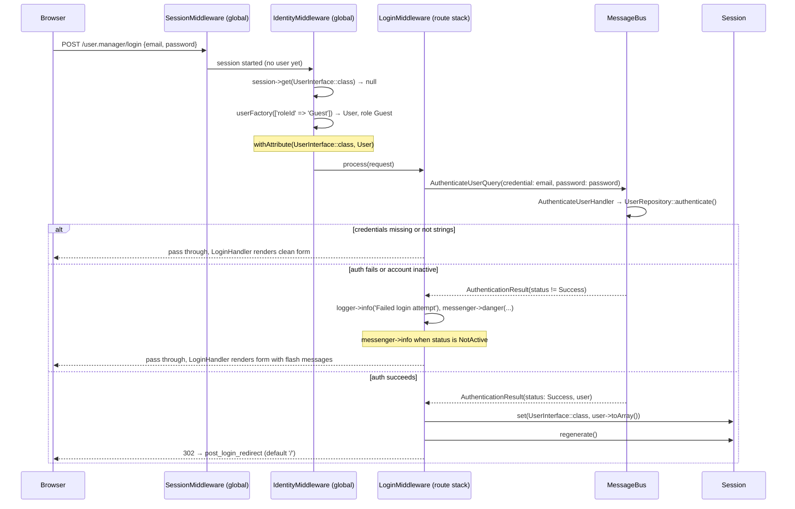
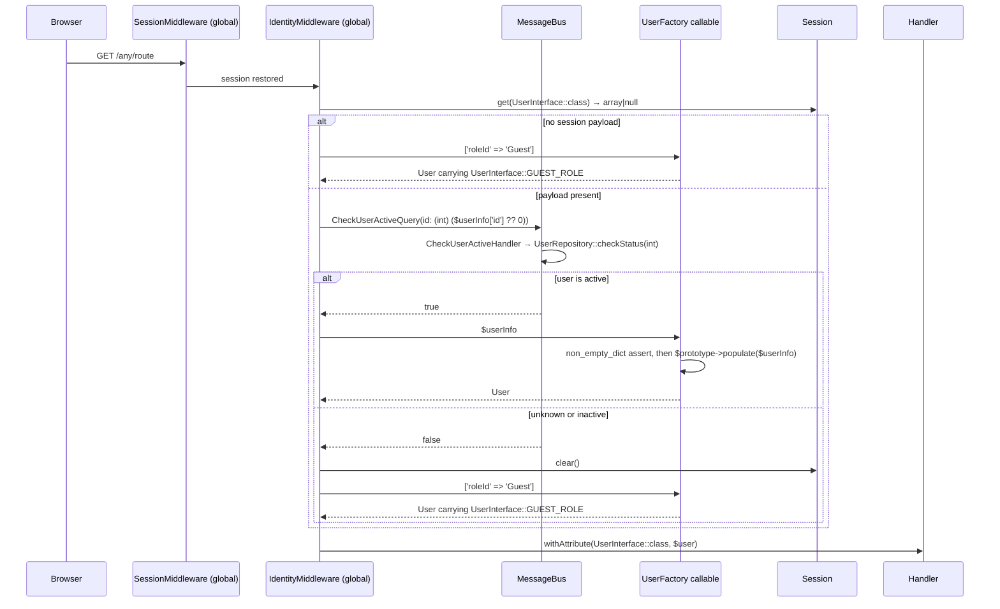

# Identity Resolution Flow

## Overview

- `IdentityMiddleware` resolves the current identity on **every** request. This package
  registers no global pipeline of its own — the application pipes it globally,
  immediately after `SessionMiddleware`.
- `LoginMiddleware` is POST-only and sits in the route stack of `user.manager.session.create`
  (POST `/user.manager/login`).
- `LoginHandler` renders the login form — on GET (`user.manager.session.read`) and on POST
  failure, when `LoginMiddleware` passes the request through with a flash message.
- `LogoutHandler` (`user.manager.logout.read`, GET `/user.manager/logout`) clears the
  session and redirects to the login route.
- `mezzio/mezzio-authentication-session` (`PhpSession`) is **not used**.
- Reads go through the MessageBus: `LoginMiddleware` dispatches `AuthenticateUserQuery`,
  `IdentityMiddleware` dispatches `CheckUserActiveQuery`. Neither middleware touches the
  repository directly.

---

## Flow 1 — Login POST



---

## Flow 2 — Session Restore (subsequent requests)



Route grants (forbidden responses, 403 pages) are decided downstream by
`webware-acl`'s `AuthorizationMiddleware`, which reads the `UserInterface::class`
request attribute. That is outside this package.

---

## Session Payload Contract

Key: `Webware\Core\UserInterface::class`.

The payload is a **RowPrototype round trip**, and both legs are declared by the core
contract: `Webware\Core\UserInterface` extends `PhpDb\ResultSet\RowPrototypeInterface`,
which defines `toArray(): array` (out) and
`populate(array $data): RowPrototypeInterface` (in).

- **Write** — `LoginMiddleware`: `$session->set(UserInterface::class, $result->user->toArray())`
- **Read** — `IdentityMiddleware` hands the stored array to the `UserInterface::class`
  callable service; `UserFactory` asserts a non-empty string-keyed dict
  (`Psl\Type\non_empty_dict`) and returns `$prototype->populate($withData)`.

`User::toArray()` is `(array) $this` and `User::populate()` is `return new static(...$data)`,
so the payload keys **are** the constructor parameter names, spread as named arguments.
An unknown key fails with `Error: Unknown named parameter`; a missing key falls back to
that parameter's default.

```php
[
    'id'                => 42,                  // int|string|null per the core interface
    'roleId'            => ['Member'],          // JSON string or array on the row; normalized to array
    'firstName'         => 'Jane',
    'lastName'          => 'Doe',
    'email'             => 'jane@example.com',  // lowercased by the setter
    'passwordHash'      => '$2y$12$...',        // #[SensitiveParameter]
    'active'            => true,
    'createdAt'         => DateTimeImmutable,   // string/array row values are normalized
    'verificationToken' => null,                // #[SensitiveParameter]
    'tokenCreatedAt'    => DateTimeImmutable|null,
    'details'           => [],                  // array<string, mixed>|null
]
```

Notes:

- Values are the raw backing values of the properties. Reading a property applies its
  hook instead (`active` reads as `false` when unset, `details` as `[]`, `createdAt` and
  `tokenCreatedAt` as "now"), so do not confuse the payload with accessor results.
- The payload is the full row, `passwordHash` included. It lives in the server-side
  session store, so never surface it to a view, a response, or a log.
- `id` may be `int|string|null`; consumers that need a strict `int` coerce at the
  boundary (`(int) ($userInfo['id'] ?? 0)`). Do not narrow the interface.
- A guest is a `User` carrying `UserInterface::GUEST_ROLE` (`['roleId' => 'Guest']`),
  not a separate class. Its `getIdentity()` returns `null`, which is what `LoginHandler`
  uses to choose between rendering the form and redirecting.

---

## File Reference

| File | Responsibility |
|---|---|
| `src/Http/Middleware/IdentityMiddleware.php` | Session restore, active check via bus, `UserInterface::class` request attribute |
| `src/Http/Middleware/Container/IdentityMiddlewareFactory.php` | Wires `MessageBusInterface` + the `UserInterface::class` callable |
| `src/Http/Middleware/LoginMiddleware.php` | Credential POST handling, session write + regenerate, redirect |
| `src/Http/Middleware/Container/LoginMiddlewareFactory.php` | Wires bus, logger, `post_login_redirect` |
| `src/Http/RequestHandler/LoginHandler.php` | Renders the login form; redirects when already authenticated |
| `src/Http/RequestHandler/LogoutHandler.php` | Clears the session, redirects to login |
| `src/Container/UserFactory.php` | `UserInterface::class` callable: non-empty dict assert, then `populate()` |
| `src/Query/AuthenticateUserQuery.php` / `src/QueryHandler/AuthenticateUserHandler.php` | Login query + handler |
| `src/Query/CheckUserActiveQuery.php` / `src/QueryHandler/CheckUserActiveHandler.php` | Identity status query + handler |
| `src/Repository/UserRepository.php` | `authenticate()` returns `AuthenticationResult` (status + hydrated `User`); `checkStatus(int): bool` backs the identity check |
| `src/Entity/User.php` | `UserInterface` + RowPrototype implementation: property hooks, `toArray()`, `populate()` |
| `src/RouteProvider.php` | `session.read`, `session.create`, `logout.read` routes |

---

## Historical Note

Shortly before this component was extracted from `tyrsson/inventory-management-system`,
identity moved to the RowPrototype implementation. Until then the session payload was a
nested `(identity, roles, details)` structure and `UserFactory` was a discriminating
closure that looked for `details['id']`, `details['role_id']` and
`details['first_name']`, falling back to a separate `GuestUser` class. The
`toArray()` / `populate()` round trip replaced both: a guest is now a `User` carrying
`UserInterface::GUEST_ROLE`, and `getIdentity() === null` marks an unauthenticated
request. The `getIdentity()` / `getRoles()` / `getDetails()` accessors on
`Webware\Core\UserInterface` are the surviving API from that shape.

Prior to 2026-05-22 this file documented three bugs where `UserFactory` always
returned `GuestUser` regardless of authentication state. All three bugs are
resolved. See git history for the original analysis.
