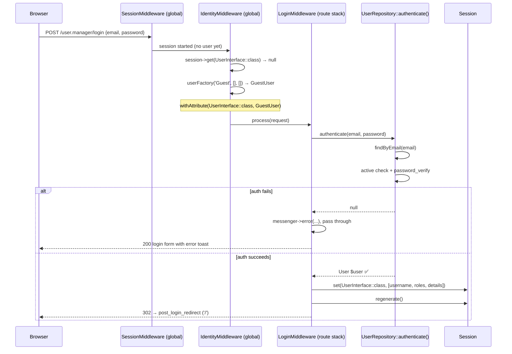
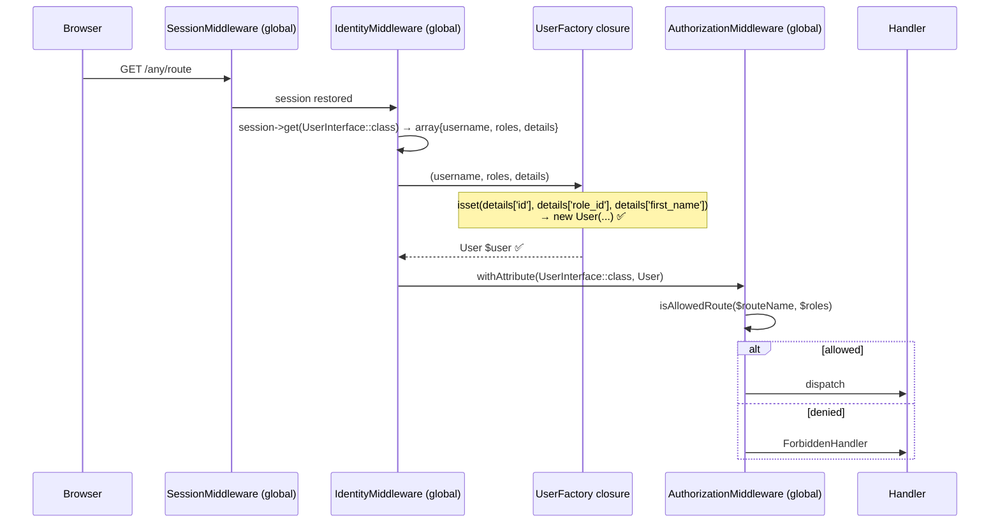

# Identity Resolution Flow

## Overview

Identity is resolved on every request by `IdentityMiddleware` (global pipeline).
Login credentials are processed by `LoginMiddleware` (route-stack, POST only).
`mezzio/mezzio-authentication-session` (`PhpSession`) is **not used**.

---

## Flow 1 — Login POST



---

## Flow 2 — Session Restore (subsequent requests)



---

## UserFactory Discriminator

`UserFactory::__invoke()` returns a closure with signature:

```php
function (string $identity, array $roles = [], array $details = []): UserInterface
```

The closure checks for authenticated-user markers in `$details`:

```php
if (isset($details['id'], $details['role_id'], $details['first_name'])) {
    return new User(
        $details['id'],
        $details['store_id'],
        $details['role_id'],
        $details['first_name'],
        ...
        $identity,   // email
        $roles,
    );
}
return new GuestUser($identity, $roles ?: [GuestUser::GUEST_ROLE], $details);
```

When `LoginMiddleware` writes session details the full user row is included, so
subsequent calls by `IdentityMiddleware` always hit the `User` branch.

---

## Session Key and Data Shape

Key: `Webware\Core\UserInterface::class`

```php
[
    'username' => $user->getIdentity(),   // email
    'roles'    => $user->getRoles(),      // e.g. ['Member']
    'details'  => [
        'id', 'store_id', 'role_id',
        'first_name', 'last_name',
        'active', 'created_at',
        'verification_token', 'token_created_at',
        'password_hash',
    ],
]
```

`IdentityMiddleware` checks `is_array($userInfo) && isset($userInfo['username'])`
before passing to the factory.

---

## File Reference

| File | Responsibility |
|---|---|
| `src/webware-usermanager/src/Middleware/LoginMiddleware.php` | Credential check, session write, redirect |
| `src/webware-usermanager/src/Middleware/Container/LoginMiddlewareFactory.php` | Wires repository, messenger, config |
| `src/webware-acl/src/Middleware/IdentityMiddleware.php` | Session restore, User/GuestUser on request |
| `src/webware-acl/src/Container/IdentityMiddlewareFactory.php` | Injects userFactory callable only |
| `src/webware-usermanager/src/Container/UserFactory.php` | Returns discriminating closure |
| `src/webware-usermanager/src/Repository/UserRepository.php` | `authenticate()` returns `(User&UserInterface)|null` — no factory call |

---

## Historical Note

Prior to 2026-05-22 this file documented three bugs where `UserFactory` always
returned `GuestUser` regardless of authentication state. All three bugs are
resolved. See git history for the original analysis.
