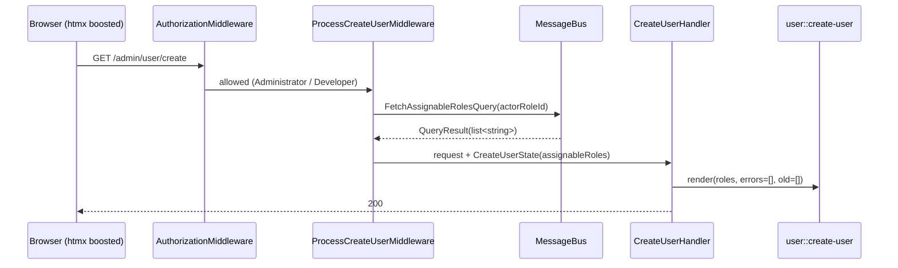
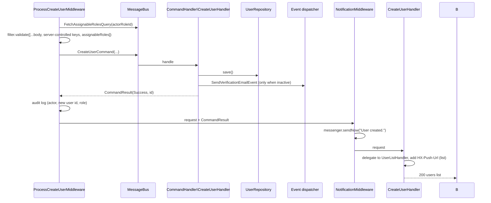

# Admin Create User: Architecture Proposal

> **STATUS: COMPLETED**: the feature shipped in PR #80 (admin create-user) and PR #82 (render-only list
> handlers, which closed the F7 empty-list defect recorded in this document). Retained as a decision record;
> delete just before the `1.0.0` stable tag is cut.

**Status:** COMPLETED 2026-10-03. Written as "proposal v2 for review (revised after your feedback of
2026-10-02). Nothing in this document is implemented." - true when written, no longer true.
**Date:** 2026-10-02 → completed 2026-10-03
**Scope:** `webware-usermanager` (owner of the feature), with the contracts it consumes from `webware-core`,
`webware-message`, `webware-htmx`, `webware-admin`, `webware-acl` and `webware-mailer`.
**Replaces:** the "Admin create-user POST processing (stub exists but no middleware)" exclusion in
[`plan-admin-edit-user.md`](../docs/plan-admin-edit-user.md).

How to read this: every statement under **Measured** was read from the code or run against the app on
2026-10-02; the evidence is named. **Proposed** is design. **Not verified** says what I could not check.
Section 12 lists the decisions I need from you; each has a recommendation, but none of them is taken.

---

## 1. Summary

`GET /admin/user/create` fails today because the page was never built. This proposal builds it as a **modal
opened from the admin user list** (the way edit already works), reusing the registration pipeline's command,
handler and event, and adding what an admin action needs that registration does not have:

1. **A role the creating admin is allowed to grant, read from the database.** The role list comes from the
   role registry (`acl_role`) through the `webware-core` `AclInterface` contract, filtered so an admin can only
   assign roles they hold themselves.
2. **Server-side validation by validators attached to the input filter**, including email uniqueness, with the
   modal re-rendered on failure.
3. **Audit logging and a notification** on the outcome.
4. **An admin never knows the user's password.** An admin-created account gets a flag that sends the user to a
   set-your-password step from the activation link. That same step is the base of the password-reset workflow
   you want (section 8.3).

Making that correct also requires fixes to code that exists today (F3, F4, F7) and changes to the fleet's
guard rules (section 5.1). Per your feedback, **all of the work lands together**, and the member list (F7) is
its own PR.

---

## 2. What exists today (Measured)

### 2.1 The route

`RouteProvider` registers `admin.user.create` for `GET` and `POST` on `/admin/user/create` with the single
pipeline `[CreateUserHandler]`, a navigation child of the Users route (label "Create User", order 10). The
Users page's "Add User" button links to it.

### 2.2 The handler

`Http\Admin\RequestHandler\CreateUserHandler::handle()` returns
`new HtmlResponse($this->template->render('user::create-user'))`. There is no `create-user` template in
`webware-usermanager/templates/default/user/`, in the app's `ims` theme, or anywhere else in the workspace,
and none in usermanager's git history (`git log --all` over `*create-user*` is empty). The handler dates from the
initial import (`a6ff3ef`, 2026-08-24). There is no POST processing at all.

### 2.3 What creation already looks like (public registration)

```
POST /user/register
  DisableBodyMiddleware → RegistrationMiddleware → RegistrationHandler
```

- `RegistrationMiddleware` builds `[...$body, 'verificationToken' => Uuid::uuid7(), 'roleId' => Role::Member,
  'active' => '0']` (server-controlled keys are placed after the body spread), validates with
  `RegistrationDataFilter`, and dispatches `CreateUserCommand` on the bus.
- `CreateUserCommand` (`Command\`) carries `firstName`, `lastName`, `passwordHash`, `email`, `roleId`,
  `verificationToken`, `active`, `tokenCreatedAt`, `createdAt`. Its `passwordHash` setter runs
  `password_hash()` when the value is not already a hash (`password_get_info()['algo'] === null`).
  It does **not** implement `NotificationCapableInterface`.
- `CommandHandler\CreateUserHandler` calls `UserRepository::save()`, dispatches `SendVerificationEmailEvent`,
  and returns a `CommandResult`.
- `UserRepository::save()` inserts through the PhpDb gateway. The `user` table has `UniqueKey('email')`
  (`UserSchema`).

### 2.4 The update pipeline (the pattern the admin UI already follows)

```
PATCH /admin/user/update/{id}
  BodyParamsMiddleware → ProcessUpdateUserMiddleware → NotificationMiddleware → UpdateUserHandler (Http)
```

`ProcessUpdateUserMiddleware` uses `HttpMethodProcessorTrait` (from `webware-core`), validates with
`UpdateUserDataFilter`, dispatches `UpdateUserCommand`, stores the `CommandResult` as a request attribute and
passes on. `UpdateUserCommand` implements `NotificationCapableInterface`, and `NotificationMiddleware`
(`webware-message`) reads `successMessage` / `failureMessage` from the command and calls
`$messenger->sendNow(message:, key:, hops: 0)`.

### 2.5 ACL

`RuleSeeds` already seeds `admin.user.create` as an Administrator allow, parented to the `admin.user` anchor
(`ADMIN_CHILDREN`), and `ConfigProvider::getAclConfig()` lists the resource. Developer has the blanket allow
that `Acl::load()` adds. **With the modal design (D1) the GET moves to a new route, `admin.user.create.modal`,
which needs its own seed row and resource entry**, exactly as `admin.user.update.modal` has; the `RuleSeedsTest`
and `ConfigProviderTest` expectations change with it.

### 2.6 Roles

- `docs/roleid-single-role-direction.md` (2026-09-17): a user has **one** role, a `string`; the `roleId` column
  is `varchar`; `User::getRoles()` wraps it.
- The role registry lives in `acl_role`. It is exposed to other components through
  `Webware\Core\AclInterface::getRoles(): array<string, string[]>` (role id → direct parent role ids), a
  `webware-core` contract implemented by `webware-acl`.
- `webware-usermanager`'s `composer.json` requires `webware-core` but **not** `webware-acl`. The two packages
  stay decoupled through core (`docs/user-interface.md`).
- Default hierarchy (`Role::getRoles()`): Guest → Member → Administrator → Developer.

---

## 3. Findings that change the design (Measured)

| # | Finding | Evidence |
|---|---|---|
| **F1** | The create page and its POST were never built (2.1, 2.2). | files, git history |
| **F2** | The edit **modal template** still has a hard-coded IMS role list in a multi-select named `roleId[]` (Sales, Warehouse, DC Warehouse, Credit Manager, Warehouse Supervisor, Manager, Administrator, Developer). The single-role *refactor* is done (`docs/roleid-single-role-direction.md`; `roleId` is a string, `User::getRoles()` wraps it for Mezzio); the template was not brought along. It offers roles that may not exist in the registry and posts an array to a filter that expects a string. **Decision (yours): the list comes from the DB** (the shared role partial, fed by the assignable-roles query). | `templates/default/user/update-user-modal.phtml` |
| **F3** | **`SendVerificationEmailEvent` has no listener.** `SendVerificationEmailListener` has a factory but `getListeners()` registers only `RegisterWidgetListener`. The app's listener provider returned 0 listeners for the event (and 2 for `RegisterWidgetEvent`). So registration dispatches an event nobody handles, and **no verification email is sent today.** **Cause, now measured in the deprecated IMS app:** IMS registered the listener in the *app's* `config/autoload/user.global.php` (`'listeners' => [SendVerificationEmailEvent::class => [['listener' => SendVerificationEmailListener::class, 'priority' => 1]]]`); the component never registered it, so the migration to the new app dropped it. Mailpit (`webware/compose.yml`, SMTP 1025, UI 8025) is the sink for testing it. | `ConfigProvider::getListeners()`; headless `getListenersForEvent()` run against the app; IMS `config/autoload/user.global.php` |
| **F4** | The listener's factory calls `Configuration::getBaseUrl()` and `getVerificationEmailSubject()`, which use `requireNonEmptyString`. Neither `base_url` nor `verification_email_subject` is set in the app's config. Wiring the listener (F3) without them throws at first use. **Reconstruction from IMS** (the old values, to be re-created in the new app, under the new key `Webware\Core\UserInterface::class`, which is `Configuration::CONFIG_KEY`): `base_url` (`http://localhost:8080`), `verification_email_subject` (`Verify your Farmers IMS account`), `verification_token_ttl` (`86400`); IMS also set `from_email` / `from_name` and the mailer adapter (`useSmtp => true`, host `localhost`, port `1025`, `smtp_auth => false`). Which of those `from_*` keys the new listener reads is not verified. | `Listener/Container/SendVerificationEmailListenerFactory.php`, `Container/Configuration.php`, grep of `webware/config`, IMS `config/autoload/{app,user,mail.local}.global.php` |
| **F5** | `CommandHandler\CreateUserHandler` does not catch exceptions from `save()`; a duplicate email escapes as an unhandled exception. **Deferred (yours): no handler try/catch until there is real use-case or case-study data** on which failures occur. With the validator in F6 the common case (duplicate) is caught before the handler. | handler source; `UserSchema` |
| **F6** | Nothing checks email uniqueness before the insert. **Decision (yours): a validator attached to the input filter**, using PhpDb's validators. **Correction:** they exist in a separate package, `php-db/phpdb-validator` (branch `0.1.x`, read 2026-10-02): `PhpDb\Validator\NoRecordExists` / `RecordExists`, `ConfigProvider` registering them under `validators` (aliases `dbNoRecordExists`, `dbRecordExists`) with `InvokableFactory`. Requires `php-db/phpdb ^0.6.0` (usermanager's lock has `0.6.x-dev`) and `laminas-validator ^2.28 \|\| ^3.0` (lock: 3.18.0). **Not in usermanager's `composer.json` or lock today.** **Gap found by reading (not run):** the constructor throws `Adapter option missing.` unless an `adapter` option is passed, but the plugin manager's `InvokableFactory` passes none, and a config-array filter spec cannot hold an adapter object. So usermanager needs a validator factory that injects `PhpDb\Adapter\AdapterInterface` from the container (or a fix upstream, which you can push). It supports `exclude` (field/value), which the update filter needs to ignore the user's own row. | `RegistrationDataFilter`, `UpdateUserDataFilter`, `php-db/phpdb-validator` `src/` |
| **F7** | **The user update route renders an empty list and never closes the modal.** `PATCH …/update/{id}` ends in `Http\Admin\RequestHandler\UpdateUserHandler`, which renders `user::list-users` with `$request->getAttribute('updatedUsers', [])`. Nothing in the fleet sets that attribute (the only other reference is its unit test), and the `HX-Trigger: closeModal` header is sent only by `UserListHandler`, which is not in that stack. *Not verified in a browser; read from the code.* | `RouteProvider`, `UpdateUserHandler.php:28`, repo-wide grep |
| **F8** | No CSRF protection exists anywhere in the fleet (no component mentions it). **Decision (yours): use Mezzio's CSRF middleware** (`mezzio/mezzio-csrf`); **it is in the composer.lock of webware-acl, webware-admin and webware-message but not in the app's or usermanager's lock**, so it is not yet usable in this feature's stack. Session cookie flags are read from `php.ini` by `PhpDbSessionPersistence` (`IniDefaults`); in this environment `session.cookie_samesite` is empty and `session.cookie_httponly` is unset. | grep; `php -r ini_get()` |
| **F9** | There is no password policy beyond "required" and "must match". The form field that carries the plaintext password is named `passwordHash` (the command hashes it on construction). **The validator is `Axleus\Validator\PasswordRequirement`** in `~/github.com/axleus/axleus-validator` (`master`, early version): options `length`, `upper`, `lower`, `digit`, `special` (counts). **It will not load under the laminas-validator 3.18 that usermanager has**: it redeclares `$messageTemplates` / `$messageVariables` without the `array` type the parent now has (fatal), declares `setValue()` without `: void` (fatal), reads `$this->getOptions()` and a `$options` property that v3 no longer has, and ignores constructor options (v3's constructor only reads translator/message keys). Its package also requires `axleus/axleus-db dev-master` and axleus-core's `ConfigProviderInterface`, allows PHP only up to 8.4 (webware allows 8.5), and its factory injects a `Laminas\Db` adapter. So the validator logic is reusable, the class needs a port to v3 (typed properties, own constructor storing the five counts as `readonly` properties, `isValid(mixed): bool`). The set-password step (8.3) is where it runs, not the admin form. | `axleus-validator/src/PasswordRequirement.php`; installed `laminas-validator` `AbstractValidator.php` |
| **F10** | A 4xx response only swaps in htmx if the theme's script allows it. The default theme does (`public/theme/default/js/app.js`, `webinertia/webware#19`); registration's 422 already depends on that. | app `app.js`; `RegistrationMiddleware` |

F3, F4, F5, F6 and F7 are defects in shipped behaviour, found while reading for this proposal. They are listed
in section 11 as prerequisite or adjacent work so they are not silently folded into the feature.

---

## 4. Principles this design follows

These are the standing conventions, with where they come from.

1. **Queries and commands go through the message bus; only handlers touch a repository.** Middleware and
   request handlers never import a repository. (Ecosystem query-bus convention; `ProcessUpdateUserMiddleware`
   is the existing example.)
2. **Repositories stay bus-agnostic.** No message-bus types in `Repository\`.
3. **Query handlers return the concrete `QueryResult`** with a component-owned payload (arrays or `readonly`
   DTOs). **Corrected by you: `PhpDb\ResultSet\**` types are legitimate return types**, so the rule has an
   exemption for that namespace; the earlier "never php-db result sets" wording is superseded. (A
   `PhpDb\ResultSet\**` exemption is a guard/perimeter question, see 5.1.)
4. **Contracts come from `webware-core`.** Usermanager must not import `Webware\Acl\…`.
5. **Server-controlled fields are set after the request body is spread**, so a client cannot override them.
6. **The user request attribute key is `Webware\Core\UserInterface::class`.** `webware-admin#44` was exactly
   this key being wrong; do not read `Mezzio\Authentication\UserInterface::class`.
7. **Guard doctrine** (`webware-tools` `mago.toml`): `Http\**\Middleware\*` classes are named `*Middleware`
   and implement PSR-15 `MiddlewareInterface`; `Http\**\RequestHandler\*` are `*Handler`; `Command\*` are
   final `*Command` implementing `NamedCommandInterface`; `Query\*` are final `*Query` implementing
   `QueryInterface`; handlers sit in `CommandHandler\` / `QueryHandler\` and implement the bus handler
   interface; DI factories nest one level down in `Container\`.
8. **Coverage floors:** 100% line coverage target and `webware-ci.json` `min_msi` / `min_covered_msi` of 95.

---

## 5. Responsibility matrix

| Component | Does | Must not |
|---|---|---|
| **webware-usermanager** | Owns the whole feature: form handler, processing middleware, input filter, validators, assignable-roles query and handler, command and command-handler changes, template, route wiring, config registration, the role-assignment policy. | Import `Webware\Acl\…`; read the role table; hold a second copy of the role list. |
| **webware-core** | Supplies the contracts usermanager consumes: `UserInterface`, `AclInterface::getRoles()`, `Role`, `HttpMethodProcessorTrait`, `RuleSeed*`. | Gain usermanager or acl behaviour. |
| **webware-acl** | Implements `AclInterface` (the role registry in `acl_role`, resource tree, `isAllowed`); enforces route access via `AuthorizationMiddleware` on `admin.user.create`; stores the seeded rule. | Learn what "creating a user" means or decide which roles an admin may grant. No change in this proposal. |
| **webware-admin** | Owns the admin name and route-name prefix that `userAdminUrl()` and the route names derive from. | Be edited for this feature. |
| **webware-message** | `NotificationMiddleware` turns the command's `successMessage` / `failureMessage` into a toast; `SystemMessenger`. | Know about users. |
| **webware-htmx** | `DisableBodyMiddleware`, `Response\Header` (`PushUrl`), the render pipeline flags `layout` / `body`. | - |
| **webware-mailer / usermanager listener** | Sends the verification email. | - |
| **webware-event** | Event dispatch (`SendVerificationEmailEvent` extends its `Event`). | - |
| **webware-phpdb** | Gateway and repository base; **the place for gaps in `php-db/*`** (your direction: `php-db/*` is the database abstraction layer, `webware-phpdb` fills what it lacks). Candidate home for the session-lifetime setting (D6). | - |
| **webware-navigation** | Renders the "Create User" nav item from the route's options (already done). | - |
| **app (`webware/webware`) / theme** | Provides config (`base_url`, `verification_email_subject`), the theme scripts that let htmx swap a 422, and (optionally) an app-owned `ims` copy of the template. | Hold usermanager business rules. |

The one decision in this table that is not obvious is **where the role-assignment policy lives**. Role
*hierarchy* is acl's data, but "an admin may grant only roles they hold" is a user-management rule. The
proposal keeps the rule in usermanager and reads the hierarchy through the core contract. See D4.

### 5.1 Guard-rule changes this design needs (webware-tools)

Measured on webware-tools `1.0.x`: the `PhpDb\**` perimeter allows it only from the repository and handler
namespaces. Your two direction changes collide with it, so webware-tools needs a change **before** the code
lands. Items 1 and 2 are implemented in `webinertia/webware-tools#45` (open; merged and tagged by you before
T4). Measured in a scratch project on mago 1.51.0: restrictions are additive, so a second restriction cannot
loosen the first; the exemption is done by narrowing `dependency` to a brace list of every PhpDb namespace
except `ResultSet` and `Validator` (a new PhpDb namespace must be added to that list), plus a separate
`PhpDb\Validator\**` restriction:

1. **`PhpDb\ResultSet\**` is exempt** (principle 3 correction); no allow-list entry is needed.
2. **`PhpDb\Validator\**` is allowed** from `Webware\**\InputFilter\**` and `Webware\**\Validator\**` (and the
   `App` and test equivalents). `Webware\**\Validator\**` may also use the other PhpDb namespaces, so the
   adapter factory (16.3) passes.
3. **New rule (your request, "so I do not forget"): PSR-7 `ResponseInterface` instances are built only inside
   PSR-7/PSR-15 request handlers.** I have not yet confirmed that no such rule exists today; the existing
   `Psr\Http\Server\**` perimeter covers the PSR-15 side only. Tracked as an issue.

---

## 6. Request flow (Proposed)

### 6.1 Route pipeline (modal, per D1)

Two routes, mirroring update (`update.modal` GET and `update` PATCH):

```
GET  /admin/user/create/modal  (admin.user.create.modal)   CreateUserModalHandler
POST /admin/user/create        (admin.user.create)         CsrfMiddleware → ProcessCreateUserMiddleware
                                                           → NotificationMiddleware → CreateUserHandler
```

The `navigation` option is **removed** from the create route (no main-navigation link); the "Add User" button
on the users list opens the modal into `#sharedModalDialog`. On success the handler returns the refreshed list
with `HX-Trigger: closeModal` (the shared-modal convention `UserListHandler` already uses; F7).

Global middleware ahead of it is unchanged and already runs on every request: identity, ACL attach, then
`AuthorizationMiddleware` (the route resource `admin.user.create` must allow the actor).

`BodyParamsMiddleware` is not needed: the form posts `application/x-www-form-urlencoded`, which Diactoros
parses natively (the registration route does not use it either). `DisableBodyMiddleware` **is** used on the
modal GET (a fragment, not a full page).

### 6.2 GET: show the modal



### 6.3 POST: valid



### 6.4 POST: invalid or failed

| Outcome | Where decided | Response |
|---|---|---|
| Validation fails (field errors, email taken, role not assignable) | `ProcessCreateUserMiddleware` | passes on with a `CreateUserState` carrying errors and the old input; the modal re-rendered in place, **422** |
| Role not assignable | same | logged at `warning` with actor and attempted role, then treated as a validation failure |
| Command fails (database error, duplicate raced past the validator) | `CommandHandler\CreateUserHandler` | **No handler try/catch for now (F5 deferred).** The exception propagates to the error handler; revisit with real failure data. |
| Actor attribute missing | `ProcessCreateUserMiddleware` | assignable roles empty, so the form cannot be submitted successfully (fail closed) |

There is exactly **one render site** for the form (`CreateUserHandler`). The registration flow renders the
form from the middleware as well as the handler; this design does not repeat that.

---

## 7. Class inventory (Proposed)

All under `Webware\UserManager\`. "Reg." is where it is registered.

### 7.1 New

| Class | Kind / rule satisfied | Job | Reg. |
|---|---|---|---|
| `Http\Admin\RequestHandler\CreateUserModalHandler` | `*Handler` | GET modal: fetches assignable roles, renders the modal fragment | route `admin.user.create.modal` |
| `Query\FetchAssignableRolesQuery` | final, `QueryInterface` | carries `string $actorRoleId` | query map |
| `QueryHandler\FetchAssignableRolesHandler` | `QueryHandlerInterface` | computes the assignable role list from `AclInterface::getRoles()` (7.3); returns `QueryResult(Success, list<string>)` | dependencies (factory in `QueryHandler\Container\`), query map |
| `Http\Admin\CreateUserState` | `readonly` value object | what the middleware hands the handler: `list<string> $assignableRoles`, `array<string,list<string>> $errors`, `array<string,string> $old`, `?CommandResult $result` | - |
| `Http\Admin\Middleware\ProcessCreateUserMiddleware` | `*Middleware`, PSR-15, `HttpMethodProcessorTrait` | GET: fetch roles, attach state. POST: fetch roles, validate, dispatch `CreateUserCommand`, audit-log, attach state | dependencies (factory in `…\Middleware\Container\`) |
| `InputFilter\CreateUserDataFilter` | `final`, extends `InputFilter` | the field rules in 8.1 | `input_filters` factories (`InputFilterFactory`) |
| `Validator\Container\NoRecordExistsFactory` | validator factory | builds `PhpDb\Validator\NoRecordExists` with the container's `PhpDb\Adapter\AdapterInterface` and table `user`, field `email` (F6); no usermanager `UniqueEmailValidator` class is needed | `validators` factories |
| `Validator\AssignableRoleValidator` | laminas validator | invalid unless the value is in `$context['assignableRoles']` | `validators` invokables |
| `templates/default/user/create-user.phtml` | template | the form (section 9) | resolved through the `user` path already registered |
| `templates/default/user/partials/role-select.phtml` | partial | one `<select name="roleId">` shared by create and edit (D9) | - |

### 7.2 Modified

| Class | Change |
|---|---|
| `Command\CreateUserCommand` | implements `NotificationCapableInterface` (still `NamedCommandInterface`); `successMessage = 'User created.'`, `failureMessage = 'User could not be created. Please try again.'`. Registration does not run `NotificationMiddleware`, so its behaviour is unchanged. |
| `CommandHandler\CreateUserHandler` | dispatch `SendVerificationEmailEvent` only when `! $command->active`, and (new, 8.3) persist the "user sets own password" flag. Registration passes `active = false`, so its behaviour is unchanged. **No try/catch (F5 deferred).** |
| `Http\Admin\RequestHandler\CreateUserHandler` | renders `user::create-user` for GET, 422 and 500; on success delegates to `UserListHandler` and adds `HX-Push-Url` for the list route. Gains `UserListHandler` and the list URL as constructor arguments. |
| `Http\Admin\RequestHandler\Container\CreateUserHandlerFactory` | supplies the new arguments. |
| `RouteProvider` | `admin.user.create` becomes POST-only with the pipeline above; new `admin.user.create.modal` GET; the `navigation` option is removed from the create route. |
| `ConfigProvider` | query map, dependencies, `input_filters`, a `validators` section, and the missing `SendVerificationEmailEvent` listener (P0, section 11). |

| `Acl\RuleSeeds` / `ConfigProvider::getAclConfig()` | seed and register `admin.user.create.modal` (Administrator allow, `ADMIN_CHILDREN`). `RuleSeedsTest` / `ConfigProviderTest` updated. |

No change to: `Entity\User`, `UserRepository`, `UpdateUserCommand` (the `UserSchema` change for the flag is in 8.3).

### 7.3 `FetchAssignableRolesHandler`: the rule

Input: the actor's role id and `AclInterface::getRoles()` (`role → direct parent roles`).

```
assignable(actor) = ({actor} ∪ ancestors(actor)) \ {Guest}
```

`ancestors` is a depth-first walk over the parent lists with a visited set (terminates even on a malformed
registry). Results are returned in registry order. An actor role that is not in the registry yields `[]`.

| Actor | Default registry | IMS-style registry (Guest → Member → Warehouse/Sales/… → Manager → Administrator → Developer) |
|---|---|---|
| Developer | Developer, Administrator, Member | everything up the chain except Guest |
| Administrator | Administrator, Member | Administrator, Manager, Warehouse/Sales/…, Member |
| Member | - (route denied anyway) | - |

Why this rule: in a Laminas ACL a role inherits every permission of its parents, so "roles the actor holds"
is the set of roles the actor already has all the permissions of. An admin cannot create an account more
powerful than their own. Guest is excluded because it is the anonymous principal, not a role an account holds
(`UserInterface::GUEST_ROLE`).

---

## 8. Data rules (Proposed)

### 8.1 Fields

| Field | Source | Filters / validators | Notes |
|---|---|---|---|
| `firstName`, `lastName` | form | `StringTrim`, required | - |
| `email` | form | `StringTrim`, `EmailAddress`, `NoRecordExists` (table `user`, field `email`; on update `exclude` the user's own id); stored lower-cased by the command | the database `UniqueKey` stays the authority; the validator exists for a friendly error |
| `passwordHash` / `confirmPasswordHash` | **not on the admin form** (8.3) | - | the admin does not choose the password |
| `roleId` | form | `StringTrim`, required, `AssignableRoleValidator` | single string |
| `active` | **server** | - | always `0` for an admin-created user; activation happens through the emailed link (8.2) |
| `verificationToken` | **server** | `Uuid` | `Uuid::uuid7()`, set after the body spread |
| `assignableRoles` | **server** | - | injected into the filter data so the validator reads it from `$context`; set after the body spread, so a posted value is overwritten |

### 8.2 Active and verification

Mirrors registration, with no admin choice (D2):

- Every admin-created user is created with `active = 0` and the password-set flag (8.3); the verification
  email is always sent. The user activates by following the link and **must create a password there**.
  There is no "Activate now" option.

This depends on the listener wiring (F3) and on the config keys in F4.

### 8.3 Password: the user sets it at activation (your direction) - **IMPLEMENTED** (webinertia/webware-usermanager#78)

The admin never enters or sees a password. As built:

- `user` gains `passwordSetRequired` (`TINYINT NOT NULL DEFAULT 0`), set to `1` by the admin create middleware;
  registration leaves it `0`. **Existing databases need
  `ALTER TABLE user ADD COLUMN passwordSetRequired TINYINT NOT NULL DEFAULT 0 AFTER active`**: `user:init-db`
  only creates the table. Applied to the dev database on 2026-10-03.
- **Deviation from the text below:** the route parameter is not needed. The flag is the single source of truth, so a
  stripped parameter cannot activate a passwordless account. The verification email links to
  `user.set.password.read` (`/user/set.password/{token}`) when the flag is set, and `ProcessVerifyEmailMiddleware`
  redirects that link to the set-password page when it is set, so the verify link also cannot activate such an account.
- `GET /user/set.password/{token}` renders the form; `POST` validates, then dispatches `SetPasswordCommand`
  (hash + clear the flag) and `ActivateUserCommand` (activate + clear the token), and redirects to sign-in.
  Tokens keep the 24-hour TTL and are single use.
- Until the user sets a password the stored hash is an unusable random value (a hash of a random secret that
  is never disclosed), so no login is possible with it.
- **Not built yet:** the password validator is `PasswordRequirement` (F9), rebuilt in `webinertia/webware-validator`
  (addendum, section 16); today the set-password filter uses `StringLength` 12-255 plus the confirmation match.
- **This is also the base of the password-reset workflow** you called out ("A password reset workflow needs
  to be created"): reset = set the flag, issue a fresh token, send the same link. Reset is not built here, but
  the flag, token and set-password step are in place for it.

---

## 9. Template and UI (Proposed)

- `create-user-modal.phtml` is a modal fragment for `#sharedModalDialog`, opened from the users list (the
  main-navigation link is removed): heading, error list, form, Cancel (`data-bs-dismiss`).
- Form: `hx-post` to `userAdminUrl('create')`, fields as in 8.1 (no password fields) plus the CSRF token
  field from Mezzio's CSRF guard; `autocomplete="off"` on role.
- `roleId` is a single `<select>` (shared `role-select` partial, also used by edit; F2) fed by the DB-backed
  assignable list; the previously selected value is preserved on a re-render.
- Every output goes through `escapeHtml` / `escapeHtmlAttr`.
- Errors: a list at the top; per-field messages can follow later. A 422 re-renders the modal in place.
- Theme: the template lives in the component and resolves through the `user` path under every theme (the app's
  `ims` theme falls back to it unless the app adds its own copy).
- The default theme must keep allowing 4xx swaps (F10).

---

## 10. Security review (Proposed, against the OWASP Top 10)

| Risk | Treatment |
|---|---|
| **A01 Broken access control** | Route access: `AuthorizationMiddleware` on `admin.user.create`, fail-closed for unregistered resources. **Privilege escalation:** the role is validated server-side against the actor's assignable set (7.3); the client's list is never trusted. A rejected role is logged. |
| **A02 Cryptographic failures** | No admin-entered password exists, so none is stored, logged or re-rendered. The placeholder hash is an unusable random value (8.3). The user's own password is hashed with `password_hash(PASSWORD_DEFAULT)` at the set-password step. |
| **A03 Injection** | All writes go through the PhpDb gateway (parameterised); all template output is escaped. |
| **A04 Insecure design** | No password policy exists (F9). I propose a minimum length on this form's filter only if you want one (D3); a policy that differs from registration is its own decision. No forced change on first login is possible until a password flow exists. |
| **A05 Misconfiguration** | The session cookie's `SameSite` and `HttpOnly` come from `php.ini`; here both are unset (F8). That is a deployment requirement to record in the installer RFC (`webinertia/project-tracking#6`), not something this feature can fix. |
| **A07 Authentication failures** | Duplicate email is refused at the validator and at the `UniqueKey`; no user enumeration concern, because the form is admin-only. |
| **A08 Software and data integrity - CSRF** | `mezzio/mezzio-csrf` guard middleware on the POST (and, as fleet-wide work, on update/toggle), token in the modal form. Requires adding the package to usermanager/app and a session guard config. **Session length** (cookie lifetime, `IniDefaults` via `PhpDbSessionPersistence`) is to be configurable; issue to be opened (D6). |
| **A09 Logging and monitoring** | The middleware writes `info` on success (actor identity, new user id, role) and `warning` on a rejected role, through `Psr\Log\LoggerInterface`, as `LoginMiddleware` does. |
| **Mass assignment** | Server-controlled keys (`verificationToken`, `assignableRoles`) are written after the body spread; only the listed fields reach the command. |

---

## 11. Sequencing: pull requests

Your direction: **the work lands together**, with the member list as its own PR. Because the pieces depend on
each other, they are listed in merge order; the feature PRs are opened as one stack and merged only when the
whole stack is green. Tags stay yours.

| PR | Repo | Contents |
|---|---|---|
| **G1** | webware-tools | guard changes (5.1): items 1 and 2 in `webware-tools#45`; item 3 (response-construction rule) is not written and is not needed for this work. |
| **V0** | webware-validator | prerequisite: clone and onboard the repo (16.1). |
| **V1** | webware-validator, php-db/phpdb-validator (yours to push) | rebuild `PasswordRequirement` for laminas-validator 3 (16.2); add `php-db/phpdb-validator` to usermanager; fix any bug found in the adapter wiring (F6). |
| **C1** | webware-usermanager | listener wired + config keys documented (F3, F4); assignable-roles query; create modal + routes + seeds; input filter + validators; command/handler changes; activation set-password flow and `UserSchema` flag + migration; shared role partial and edit-modal fix (F2); CSRF on the POST. |
| **A1** | webware (app) | config keys from the IMS reconstruction, mailer pointing at Mailpit, `mezzio-csrf` wiring, session settings. |
| **M1** | webware-usermanager (own PR, per you) | member list mock-up and completing the update route's list/close behaviour (F7). |

Issues to open: session length configurable (webware-phpdb); response-construction guard rule (webware-tools);
fleet-wide CSRF tracking.

---

## 12. Decisions

Accepted = your answer or my recommendation you did not contradict.

| # | Decision | Outcome |
|---|---|---|
| **D1** | Page or modal | **Changed: modal** from the admin user list; main-navigation link removed (6.1, 9). |
| **D2** | Active and verification | **Changed (yours): no "Activate now".** Always inactive, always send the link, password creation forced at activation (8.2, 8.3). |
| **D3** | Initial password | **Changed: the user sets it at activation** via a flag column and activation-route parameter; reset workflow to follow (8.3). |
| **D4** | Assignable-role rule | Accepted. |
| **D5** | Where the policy lives | Accepted (usermanager). |
| **D6** | CSRF / session | **Changed:** use `mezzio-csrf` in this work; open an issue for configurable session length. |
| **D7** | Duplicate email | **Changed:** a PhpDb validator on the input filter (F6); database key stays authority; no handler catch (F5 deferred). |
| **D8** | Notification | Accepted. |
| **D9** | Shared role partial | **Changed:** lands with this work ("as long as all of this work lands together"). |
| **D10** | Adjacent fixes | **Changed:** F3/F4 land with the stack; F7 (member list) is its own PR. |

---

## 13. Test plan

PHPUnit 13 with `#[CoversClass]` and `#[CoversMethod]` on every test class (`requireCoverageMetadata`),
`createStub()` for value doubles and `createMock()` only with `expects()`. Floors: 100% line coverage target,
95% MSI and covered MSI.

**Unit**

- Mocked identity: tests supply the actor through a **stubbed `Webware\Core\UserInterface` request attribute**; no
  real session is needed (answering your "can we not mock a session?"). Session persistence itself stays
  covered in webware-phpdb.
- Email: unit tests assert the dispatched `SendVerificationEmailEvent`; end-to-end delivery is tested against
  **Mailpit** (app dev) and webware-mailer's fake SMTP server (`test/integration/TestAsset/fake-smtp-server.php`).
- `FetchAssignableRolesHandlerTest`: default registry for each role; an IMS-style registry; Guest excluded;
  unknown actor role gives `[]`; a registry with a cycle terminates.
- `AssignableRoleValidatorTest`, `NoRecordExistsFactoryTest`: valid, invalid, missing context, existing user.
- `CreateUserDataFilterTest`: each field, password mismatch, role outside the set, a posted
  `verificationToken` / `assignableRoles` overwritten by the server values.
- `ProcessCreateUserMiddlewareTest`: GET attaches state; POST invalid (no command dispatched); POST valid
  dispatches the exact command; a rejected role is logged at `warning`; actor attribute missing fails closed;
  the user attribute is read by the **`Webware\Core\UserInterface`** key (regression for `webware-admin#44`).
- `CreateUserHandlerTest` (Http): 200 form, 422 with errors and old input, 500 on failure, success delegates to
  the list handler and sets `HX-Push-Url`; no password in the rendered variables.
- `CommandHandler\CreateUserHandlerTest`: event only when inactive; flag persisted.
- `CreateUserCommandTest`: both messages; still a `NamedCommandInterface`.
- `ConfigProviderTest`: query map, listener (P0), input filter, validators.
- `RuleSeedsTest`: updated for `admin.user.create.modal`.

**Integration**

- A middleware-stack test with the real `InputFilterPluginManager` and an in-memory registry: an Administrator
  cannot create a Developer, a Developer can.
- Repository integration is unchanged.

**Manual** (needs the app logged in as Developer and as Administrator): create inactive (email sent), create
active, duplicate email, role outside the set rejected, Cancel, nav item, 422 re-render keeps input and drops
the passwords.

---

## 14. Not verified

- The F7 behaviour in a browser (read from code only).
- Whether `phpdb-validator` works inside the input filter end to end (read, not run); whether a tagged release exists.
- Whether a guard rule restricting `ResponseInterface` construction already exists (5.1, item 3).
- Which IMS `from_*` config keys the new listener reads (F4).
- Whether `HX-Push-Url` on a boosted `POST` response updates the address bar as intended.
- Whether `user:init-db` needs `acl:init-db` first (relevant to the installer RFC, not to this feature).
- The `ims` theme's own `user/` template copies in the app; I did not review them for create.

## 15. Out of scope

Password change; self-service profile editing; `storeId` migration; deleting users; bulk import;
role management (acl's); changing registration's public behaviour beyond P0 and the two
handler changes in 7.2.

---

## 16. Addendum: `webinertia/webware-validator` and the `PasswordRequirement` rebuild

### 16.1 Prerequisite V0: onboard the repository

Measured 2026-10-02: `webinertia/webware-validator` is public, default branch `1.0.x`, one commit
(`Initial commit`), and it is the **unrenamed `webware/skeleton`** (composer `name` `webware/skeleton`,
namespace `Webware\Skeleton`, `webware-tools ^1.0.0-beta.3`). Steps:

1. Clone to `~/github.com/webinertia/webware-validator`.
2. Apply the skeleton's README rename checklist: composer `name` `webware/webware-validator`, description,
   `extra.laminas.config-provider`, both PSR-4 roots (`Webware\Validator\`, `WebwareTest\Validator\`,
   `WebwareTestIntegration\Validator\`), namespaces and file headers, `.github/copilot-instructions.md`
   title, badges, LICENSE.
3. Move `webware/webware-tools` to `^1.0.0-beta.8` (beta.5 first shipped
   `agent-working-agreements.md`) and refresh the lock.
4. Run the gates: Mago format, lint, analyze, guard; PHPUnit; mutation test. All must exit 0.
5. One PR into `1.0.x`. The repository has no `ci-target` evidence yet; whether the org required workflow runs
   on it is **not verified**.

### 16.2 `PasswordRequirement` for laminas-validator 3 (V1)

Class `Webware\Validator\PasswordRequirement`, `final`, extends `Laminas\Validator\AbstractValidator`.
Changes from the axleus version (F9):

| Axleus | Rebuilt |
|---|---|
| `Axleus\Validator` namespace, axleus-core `ConfigProviderInterface`, axleus-db dependency | `Webware\Validator`; plain `ConfigProvider`; **no axleus dependency** |
| untyped `$messageTemplates`, `$messageVariables` | `protected array` typed; `$messageVariables` maps each placeholder to a `protected readonly int` property name (`'length' => 'length'`) |
| `protected $options`, `getOptions()` | five `protected readonly int` properties `length`, `upper`, `lower`, `digit`, `special`, set by an own constructor from the options array, then `parent::__construct($options)` |
| public `setValue($value)` override, `isValid($value)` | none; use the parent's protected `setValue()`; `isValid(mixed $value): bool` |
| `strlen()`, `[A-Z]` regexes | `mb_strlen()`; the same upper / lower / digit / special classes; special set is the existing `POSSIBLE_SPECIAL_CHARS` |
| `Container\Factory` building a `Laminas\Db` adapter-aware validator | `InvokableFactory`-style registration; the validator needs no adapter |

Defaults come from config under `Webware\Validator\PasswordRequirement::class` (`length`, `upper`, `lower`,
`digit`, `special`), registered by `ConfigProvider` under `validators` with a small factory that merges config
and call-site options. Axleus defaults were 8 / 1 / 2 / 2 / 2; choosing webware's defaults is yours.
Not a database validator; no `php-db` dependency.

Tests: each rule alone, all rules together, boundary counts, multibyte input, option override, every message
template and placeholder. Coverage and MSI floors as usual.

### 16.3 NoRecordExists adapter factory (F6)

In usermanager, `Validator\Container\NoRecordExistsFactory` builds `PhpDb\Validator\NoRecordExists` with
`['adapter' => $container->get(PhpDb\Adapter\AdapterInterface::class), 'table' => 'user', 'field' => 'email']`
merged with call-site options (so the update filter can pass `exclude`). Registered under `validators`
`factories`, replacing the alias's `InvokableFactory`. Whether the same fix belongs in `php-db/phpdb-validator`
itself is yours to decide as maintainer.

**Registration (found by the T4 agent run):** the guard allows `PhpDb\Validator\**` only from `*\InputFilter\**` and
`*\Validator\**`, so the root `ConfigProvider` cannot name `NoRecordExists::class`. The `validators` config lives in
`Webware\UserManager\Validator\ConfigProvider`, which the root provider merges.

**Consequences of adding `php-db/phpdb-validator` (measured by the agent):** it is not on Packagist (VCS entry,
`0.1.x-dev`); it required `laminas-translator ^1.0`, which would have downgraded the lock from 2.0.0 to 1.3.0 -
fixed upstream in `php-db/phpdb-validator#8` (`^2.0`; #9 raised its PHP floor to 8.3 to match `php-db/phpdb`
0.6.x, which unblocked its CI). Moving `php-db/phpdb` to `ed4a407` removes `PhpDb\Sql\Exception\ExceptionInterface`
and `PhpDb\TableGateway\Exception\ExceptionInterface` (`PhpDb\Exception\ExceptionInterface` is now the only
marker, upstream `01a9406b`) and breaks 22 analyzer findings in `Repository`. Decision (yours): fix it now; it is
agent task T3b, in front of T4.

---

## 17. Browser test findings (2026-10-02, PR #76 running in the app)

| # | Finding | Evidence | Where it is handled |
|---|---|---|---|
| **B1** | The create modal opens, lists only the roles the actor may assign (from the database), and a duplicate email returns 422 with `HX-Retarget` / `HX-Reswap` and the error inside the modal, input preserved. | browser | none needed |
| **B2** | **A valid create is impossible:** `NoRecordExists` reports "found" for a nonexistent email. `query()` returns `current()`, which is `false` for no rows under PDO, and the validators test `!== null`. | validator run against the dev database | agent plan T8 (upstream `php-db/phpdb-validator`) |
| **B3** | The app lacked `php-db/phpdb-validator` (a dependency's VCS entry does not propagate). | `Class "PhpDb\Validator\NoRecordExists" not found` | `webinertia/webware#24` |
| **B4** | **The edit flow has no role-assignment check** (privilege escalation): `UpdateUserDataFilter` only requires a string and the middleware passes any posted role. | code | **Fixed** in webinertia/webware-usermanager#80 (T7) |
| **B5** | **Array input is not rejected.** `roleId[]` passes `UpdateUserDataFilter` valid and stays an array (the edit modal posts `roleId[]`); on create, `email[]` makes `NoRecordExists` throw (500). | filters run with array input | **Fixed** in #80: `StringLength` runs first on every string field with `break_chain_on_failure`, and the edit modal no longer posts an array |
| **B6** | Existing-email message is the generic "A record matching the input was found". | browser | **Fixed** in #80: `An account with this email already exists.` |
| **B7** | Not verified: verification email delivery to Mailpit; valid create end to end; the edit modal in the browser. | - | Create verified end to end 2026-10-03 (create → Mailpit link → set password → sign-in); the edit modal still needs a browser pass on #80 |
